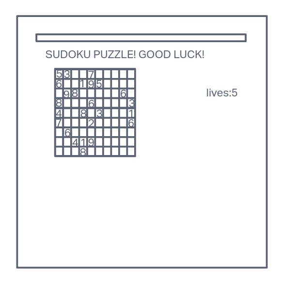

# Sudoku Showdown!
Get ready for an electrifying Sudoku showdown! Since I was a child, this mind-boggling game has captured my heart and ignited my passion. The memories of my awe-inspiring grandma conquering a book full of these puzzles are forever etched in my mind. Brace yourself for an exhilarating journey into the world of Sudoku, where the thrill of solving this tantalizing grid will leave you on the edge of your seat!
## How to play
The concept is simple: ensure that each column, row, and box contains numbers 1 to 9 without repetition. You will be provided with starter numbers in various boxes on the board, and it will be your job to fill in the remaining blanks. You will start with five lives, and for every mistake you make, you will lose a life. If you run out of lives, you lose the game.
## Tech in use
*HTML\
*CSS\
*JavaScript\
## Wireframe

## MVP Goals
 *Render a game with a fixed sudoku board that had a hard coded solution\
 *Render a game board with starting numbers in the browser as well as an indicator that states how many lives the player has.\
 *Have player able to click on a cell of the board and type their number into a cell\
 *Have player lose a life when a guess is wrong\
 *When the player solves the puzzle render a congradulations message, if player looses lives, render a you lose message\
 *Include a play again button to reset the game\

## Stretch goals
*Create a randomized puzzle generator upon hitting the play again button\
*Create a difficulty setting to increase difficulty from easy, medium and hard\
*Create an obvious loss of lives indicator\
## Potential Roadblocks
*I forsee the logic behind creating a solution being rather difficult\
*I also forsee the way the starting numbers being arranged on gameStart being hard to guage weather or not the puzzle will be too hard to solve
